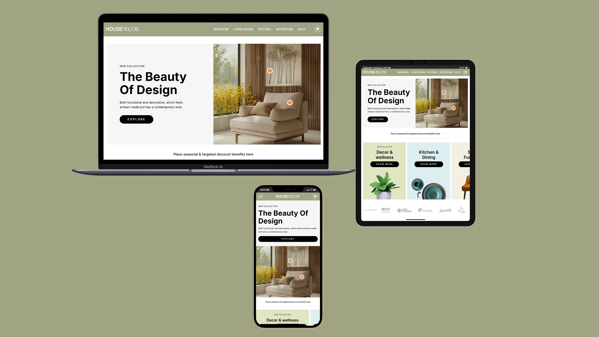

# House Decor

**Role:** Front-End Developer | Figma to HTML | Responsive Design | Animation

🌐 [View Live Project](https://oleksandrmul.github.io/home-decor/)

---

## Project Description
Developed a modern, fully responsive **one-page website** for a fictional home decor brand.  
The project includes multiple sections: **Hero, Bedroom, Living Room, Kitchen, Bathroom, Sale** — all with smooth navigation and engaging user interactions.

### Key Features
- ✅ Implemented **scroll-based navigation** with smooth transitions between sections  
- ✅ Added **interactive tooltips** to highlight materials and decor items on hover  
- ✅ Created **custom animations and hover effects** to improve user engagement  
- ✅ Built a **dynamic sponsors ticker** using JavaScript  
- ✅ Developed a **responsive "Categories" slider** for tablet view to optimize space and enhance usability  
- ✅ Designed the **"Sellers" section** with a CSS Grid layout — adaptive to all screen sizes, ensuring products are always visible without extra user actions  
- ✅ Followed **best practices** for semantic HTML5, SCSS structuring, and mobile-first development

---

## Result
A visually appealing, user-friendly, and performance-optimized landing page with thoughtful **UX decisions** tailored to different screen sizes.

